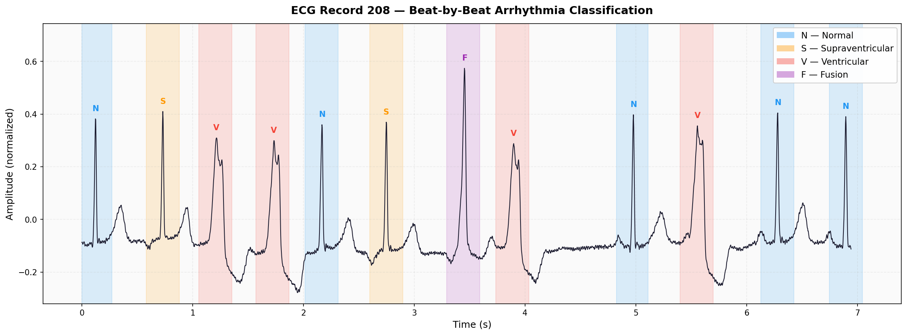

# heartbeat-classifier

**ECG arrhythmia detection and classification using deep learning on the MIT-BIH database.**

End-to-end pipeline for automatic beat-by-beat cardiac arrhythmia classification from ECG signals. The model achieves competitive results against the ANSI/AAMI EC57:1998 standard for ambulatory arrhythmia monitoring.

---

## Overview

Cardiovascular diseases are the leading cause of death worldwide. Accurate, automatic detection of arrhythmias from ECG recordings is critical for early diagnosis and treatment. This project trains a dilated 1-D convolutional neural network to classify every sample of an ECG recording into one of five standard arrhythmia classes.

### Beat-by-beat classification example

<p align="center">
  
</p>

> Each coloured region marks a single heartbeat classified by the model.
> **N** = Normal, **S** = Supraventricular, **V** = Ventricular, **F** = Fusion — from MIT-BIH record 208.

### Arrhythmia classes (ANSI/AAMI EC57)

| Label | Class | Example codes |
|-------|-------|---------------|
| N | Normal / bundle-branch block | N, L, R, B |
| S | Supraventricular ectopic | A, a, J, S, j |
| V | Ventricular ectopic | V, E |
| Q | Unknown / paced | /, f, Q |
| F | Fusion | F |

---

## Results

| Metric | Value |
|--------|-------|
| Best validation accuracy | 92.5% |
| Best validation loss | 0.549 |
| Epochs trained | 10 / 100 (early stopping) |
| Model parameters | 8.6M |

> Trained on the MIT-BIH Arrhythmia Database with balanced class weighting to handle the heavy N-class imbalance typical of ambulatory ECG recordings.

---

## Architecture

```
Input (5000 × 2)
    │
    ▼
┌──────────────────────────────────────────────────┐
│  Encoder × 3 stages  (64 → 128 → 512 filters)    │
│  Each stage:                                     │
│    4× [Conv1D → LayerNorm → BatchNorm → Dropout] │
│    + MaxPooling1D                                │
└──────────────────────────────────────────────────┘
    │
    ▼
┌──────────────────────────────────────────────────┐
│  Decoder                                         │
│    3× Conv1DTranspose (256 filters)              │
│    Dense(256) → LayerNorm → BatchNorm → Dropout  │
│    Dense(128) → Dense(6, softmax)                │
└──────────────────────────────────────────────────┘
    │
    ▼
Output (5000 × 6)  ← per-sample class probabilities
```

- **Dilated convolutions** capture multi-scale temporal patterns without excessive depth.
- **Moving-average post-processing** smooths per-class probability outputs before decoding.
- **Data augmentation**: low-pass, high-pass, band-pass filtering; white noise; baseline wander; 50 Hz power-line interference.
- **Balanced class weighting** compensates for the heavy N-class dominance in MIT-BIH.

---

## Dataset

The [MIT-BIH Arrhythmia Database](https://physionet.org/content/mitdb/1.0.0/) (PhysioNet) contains 48 half-hour two-channel ambulatory ECG recordings at 360 Hz. Records are split into train / validation / test sets (≈55 / 15 / 30) with stratification by dominant arrhythmia class.

---

## Dataset setup

Download the [MIT-BIH Arrhythmia Database](https://physionet.org/content/mitdb/1.0.0/) and extract the contents into `original_database/` at the repository root:

```
original_database/
├── 100.dat
├── 100.hea
├── 100.atr
├── 101.dat
...
```

The preprocessing pipeline also expects the raw ECG signals and annotations under `semi_preprocessed_signals/`. Use the [WFDB toolchain](https://www.physionet.org/content/wfdb/) to extract them:

```
semi_preprocessed_signals/
├── original_ecg/          # tab-separated: sample_index, ch1, ch2  (one file per record)
└── original_annotations/  # space-separated: timestamp, sample, label, 0, 0, 0
```

Extract signals with `rdsamp` and annotations with `rdann` — repeat for all 48 records:

```bash
rdsamp -r original_database/100 -H -c -v \
    > semi_preprocessed_signals/original_ecg/100.csv
rdann  -r original_database/100 -a atr \
    > semi_preprocessed_signals/original_annotations/100.csv
```

---

## Installation

### Requirements

- Python ≥ 3.10
- [uv](https://docs.astral.sh/uv/) (recommended) or pip
- [WFDB software package](https://www.physionet.org/content/wfdb/) — required for beat-by-beat evaluation (`wrann`, `bxb`)

### With uv (recommended)

```bash
git clone https://github.com/anchu09/heartbeat-classifier.git
cd heartbeat-classifier
uv sync --extra data --extra metal   # --extra metal for Apple Silicon GPU
```

### With pip

```bash
pip install -e ".[data,metal]"
```

---

## Usage

### 0. Download the dataset

Downloads the MIT-BIH Arrhythmia Database (~100 MB) from PhysioNet and extracts
all 48 records into the expected directory structure automatically:

```bash
hbc-download --data-root .
```

This creates:
- `original_database/` — raw `.dat`, `.hea`, `.atr` files
- `semi_preprocessed_signals/original_ecg/` — tab-separated ECG CSVs
- `semi_preprocessed_signals/original_annotations/` — space-separated annotation CSVs

### 1. Preprocessing

```bash
hbc-preprocess --data-root .
```

Five steps: normalize → label silence → apply beat window → map to ANSI/AAMI classes → slice into 5000-sample windows.

### 2. Training

```bash
hbc-train --data-root . --output-dir results/run_01
```

Outputs:
- `results/run_01/model.keras` – final trained model
- `results/run_01/model_best.keras` – best checkpoint by val_loss
- `results/run_01/label_encoder.pkl` – fitted label encoder
- `results/run_01/training_history.json` – loss and accuracy per epoch
- `results/run_01/training_history.png` – loss and accuracy curves

### 3. Evaluation

```bash
hbc-evaluate \
    --model results/run_01/model_best.keras \
    --data-root . \
    --output-dir results/eval_01
```

Outputs:
- `results/eval_01/bxb/` — WFDB annotation files and beat-by-beat comparison (requires `wrann`/`bxb`)
- `results/eval_01/plots/` — one ECG + prediction overlay plot per test segment

### End-to-end

```bash
hbc-download   --data-root .
hbc-preprocess --data-root .
hbc-train      --data-root . --output-dir results/run_01
hbc-evaluate   --model results/run_01/model_best.keras --data-root . --output-dir results/eval_01
```

---

## Project structure

```
heartbeat-classifier/
├── src/
│   └── heartbeat_classifier/
│       ├── config.py               # All constants (sample rate, window size, …)
│       ├── models/cnn.py           # Dilated 1-D CNN architecture
│       ├── data/
│       │   ├── download.py         # MIT-BIH download & extraction (hbc-download)
│       │   ├── generator.py        # Keras Sequence data generator
│       │   └── loader.py           # Record loading & train/val/test split
│       ├── preprocessing/
│       │   ├── signal_processor.py # Padding, windowing, normalization & pipeline entry-point
│       │   ├── annotation_processor.py  # ANSI/AAMI code mapping
│       │   └── signal_slicer.py    # Windowed segment extraction
│       ├── augmentation/
│       │   └── transforms.py       # Random ECG augmentations
│       ├── training/
│       │   └── trainer.py          # Training loop & model persistence
│       ├── evaluation/
│       │   └── evaluator.py        # Inference, decoding & WFDB evaluation
│       └── utils/
│           └── time_utils.py       # WFDB timestamp helpers
├── scripts/
│   ├── preprocess.py
│   ├── train.py
│   └── evaluate.py
├── tests/
│   ├── test_preprocessing.py
│   └── test_augmentation.py
├── pyproject.toml
└── README.md
```

---

## License

MIT
